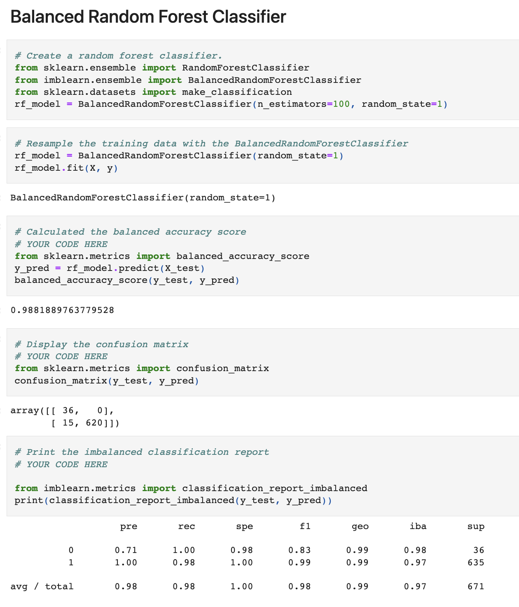
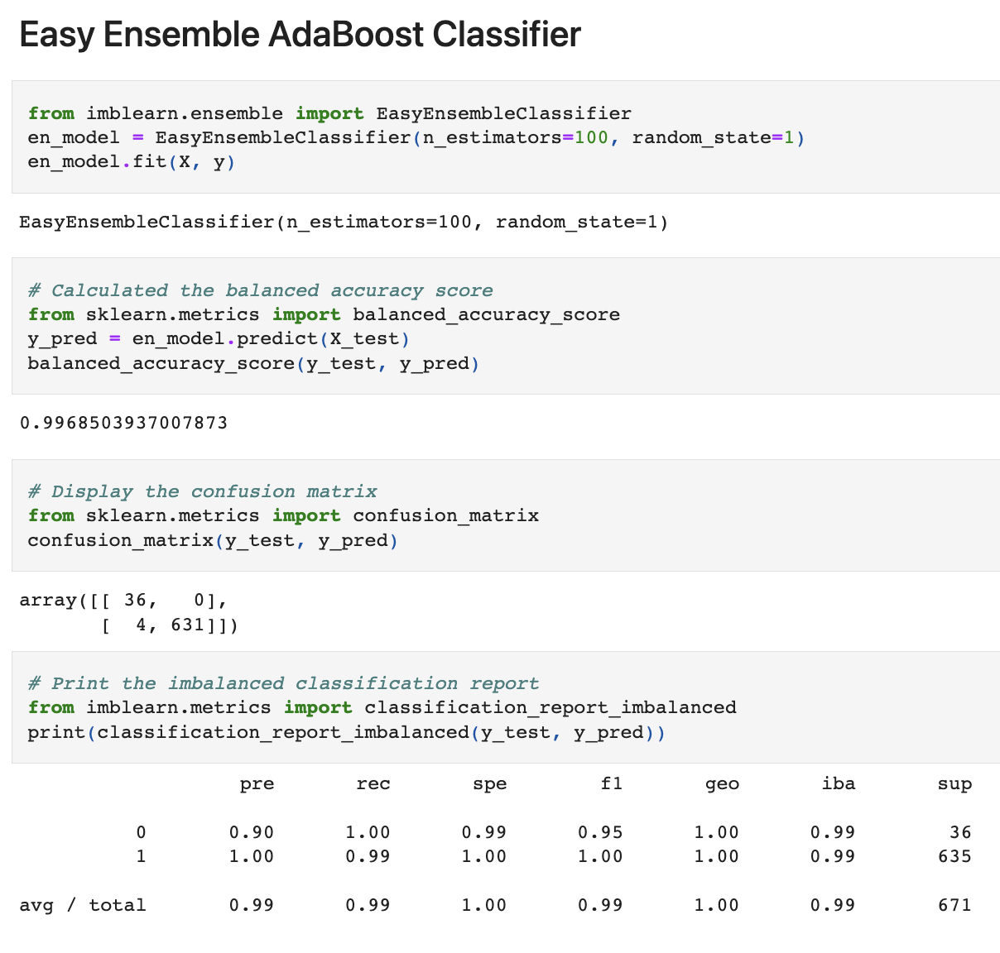
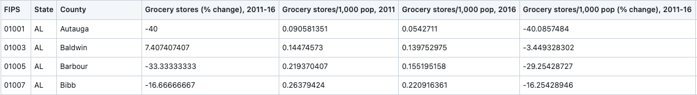
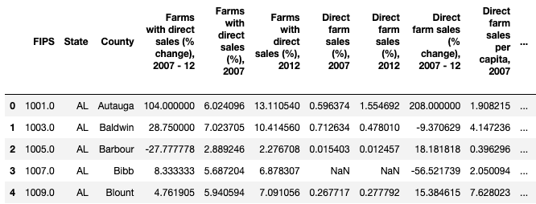
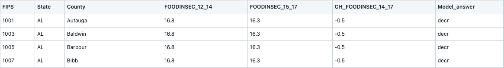
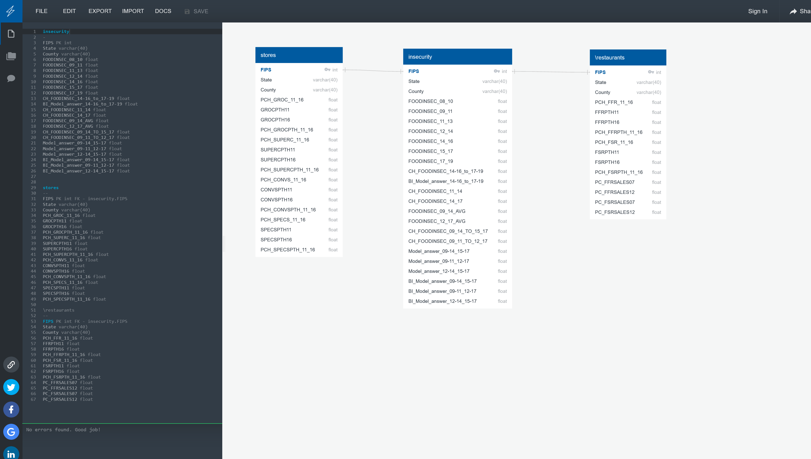

# Final Project: Food Insecurity <dl><sub>by SQL Team 6</sub></dl>


## Overview 
The purpose of this project is to utilize Machine Learning to Predict and Visualize Food Insecurity in the United States of America. It will also take an in depth look at physical access to food in the US and its effects on food insecurity.

### Background
SQL Team Six started the Project initially sharing a concensus to explore datasets  related to Agriculture in general, and Urban Agriculture in New York City. The team members were assigned various roles to seek out potential datasets and sources of data related to the proposed topic. Following the initial meeting, where the various datasets were examined, it was decided that the dataset from the United States Department of Agriculture (USDA) was large enough and had an adequate number of variables which could be manipulated. While team members were contemplating on the ideal dataset to work with, suggestions were welcomed from members pertaining to the Research Question(s)/Hypothesis.

Teammates came up with a number of proposed research questions by the second meeting and the USDA dataset was split among members to clean and filter into tables. It was decided that the Topic of the Project was going to be about Food Insecurity in the USA. Tasks were assigned to each team member and the datasets were expected to be committed to the SQL Team Six repository on individual branches. 

The Highlight of the third meeting was having the datasets from the USDA collated and deciding on which variables were measurable enough to be used in a machine learning model. The Local, Restaurants, Stores and Insecurity Datasets were chosen and the irrelevant datasets were removed from the team github repository by every team member. Teammates then assigned themselves tasks to clean up the README.

The team concluded the Project Week 1 submission deliverables during the fourth meeting by finishing up with the Schema for the database. The README was updated with screenshots of the tables and the Entity Relationship Diagram (ERD) in time for submission. This meeting involved deliberations on the possible model to use for the machine learning portion of the project. A team member took up the task of searching for data to complement the alreading existing data in order to have the dates synchronized accross the datasets. A couple of the team members took responsibility for the cleaning up and transformation of the data and testing the proposed machine learning model. 

Following the submission of the first project deliverable, Team 6 moved on to planning for submission of the next deliverable. Numerous deliberations took place, with teammates deciding to obtain some time-specific dataset in order to run the unsupervised machine learning model proposed. Other members were assigned to work on dashboard visualizations, after the final cleaned data was uploaded. A draft powerpoint presentation was  also started as a guide to the final presentation expected by Group 6, upon completion of the final project.

An Emergency meeting was required prior to the sixth meeting/submission day meeting during which the first Machine learning model was reviewed and an extra food insecurity dataset from 2017 to 2019 was retrieved to compare the model which would run on data from 2011 to 2016. Visualizations were also reviewed and suggestions were made. 

Team 6 met again on submission day of the second Deliverable to review the Machine learning models proposed, the visualizations and powerpoint presentations. Team members split tasks in order to get the github cleaned up and files and folders organized for submission. 

Below, we shall outline and delve into the various elements of the Food Insecurity Project.

### Dataset
SQL Team Six originally expressed interest in agricultural data and found a comprehensive data set from the United States Department of Agriculture. It contains country wide information on food insecurity and its related areas on a state and county level. 

The original 2020 Food Environment Atlas dataset can be found [here](https://www.ers.usda.gov/data-products/food-environment-atlas/data-access-and-documentation-downloads/).
Direct download [here.](https://www.ers.usda.gov/webdocs/DataFiles/80526/FoodEnvironmentAtlas.xls?v=2489.7)<br>


[2008-2010 food insecurity data](https://www.ers.usda.gov/webdocs/publications/44906/6893_err125_2_.pdf?v=5244)  <br>
[2009-2011 food insecurity data](https://www.ers.usda.gov/webdocs/publications/45020/30967_err141.pdf)  <br>
[2011-2013 food insecurity data](https://www.ers.usda.gov/webdocs/publications/45265/48787_err173.pdf)  <br>
[2014-2016 food insecurity data](https://www.ers.usda.gov/webdocs/publications/84973/err-237.pdf?v=219.4)  <br>

Datasets used for the projet/analysis:<br>
[insecurity.csv](https://github.com/macicchino/Food_Insecurity/blob/main/Datasets/insecurity.csv)<br>
[stores.csv](https://github.com/macicchino/Food_Insecurity/blob/main/Datasets/stores.csv)<br>
[restaurants.csv](https://github.com/macicchino/Food_Insecurity/blob/main/Datasets/restaurants.csv)<br>

### Supervised Machine Learning Model:

Machine learning is the use of statistical algorithms to perform tasks such as learning from data patterns and making predictions. 

We use a number feature variables, on a county level for time periods from 2016 and earlier to predict food insecurity after 2017. Specifically, we look to predict the binary change of the food insecurities increase of deacrease by State. We identified The Balanced Random Forest Classifier and the Easy Ensemble AdaBoost Classifier as our best sampling methods using Confusion Matrices and Accuracy Scores. 

Two key issues with out model is (1) balancing the heavily skewed dataset and (2) making state level predictions using county level features.  


### Model Results: Confusion Matrix and Accuracy Scores:

Balanced Random Forest Classifier



Easy Ensemble AdaBoost Classifier




### Description of Data
The Tables below include Stores Table, Local Table, Restaurants Table and Insecurity Table. 

### Tables 

**Stores Table**
The Stores Table shows the change by percentage(%) of Grocery stores from 2011 to 2016 by FIPS, State and County.



**Local Table**

 The Local Table shows the change by percentage(%) of Direct Farm Sales, Farms with Direct Sales and Direct Farm Sales per capita, Farmers Markets, Farms with vegetables harvested for fresh markets, Vegetable acres harvested for fresh markets, CSA Farms and Agritourism operations from 2007 to 2012 by FIPS, State and County.



**Restaurants Table**

 Restaurants Table shows the change by percentage(%) in Fast Food  and Full Service Restaurants from 2011 to 2016 by FIPS, State and County.


**Insecurity Table**

 Insecurity Table shows the change by percentage(%) of Food Insecurity, C from 2012-2017 by FIPS, State and County.



### Table Schemas

**Insecurity Schema**

The Entity Relationship Diagram linking the Insecurity, Restaurants, Local and Stores Data was constructed to develop a Schema for the 4 tables (as shown in the image below)



<details><summary>Column names:</summary>
<p>

#### Table 1:

```| First Header  | Second Header |
| ------------- | ------------- |
| Content Cell  | Content Cell  |
| Content Cell  | Content Cell  |
```

 #### Table 2:

```| First Header  | Second Header |
| ------------- | ------------- |
| Content Cell  | Content Cell  |
| Content Cell  | Content Cell  |
```
 
</p>
</details>

## Objective
From the above data set the team will look at agriculture, general grocery access, and the restaurant industry as it relates to food insecurity. With this data, the group hopes to draw comparisons and craft conclusions about how physical access to food influences food insecurity. A model will also be created that predicts possible changes in food insecurity based on the original data.

### Questions
How does physical access to food through restaurants and grocery stores impact food insecurity?

#### Potential topics
- How are fast food expenditures related to food insecurity?
- Does restaurant availability contribute to lowering food insecurity?
- Which has a higher positive impact on food access: having more farmers markets or more general grocery stores?
- How does agritourism influence food insecurity?
- How do community supported farms verses regular farms have an impact?

## Descriptive Analysis and Data Visualization

### Food Insecurity by State(%)
Between 2008 and 2010, the top 5 States with the lowest levels recorded for Food Insecurity were North Dakota, Virginia, New Hampshire, Delaware and Minnesota. Food Insecurity however increased between 2011 and 2013 for the first 22 States, recorded with the lowest levels of Food Insecurity.  
Mississipi recorded the highest level of Food Insecurity, followed by Texas, Alaba, Arkansas and Georgia between 2008 and 2010 as the 5 Food Insecure States in the USA. Food Insecurity improved for 3 of these 5 States, with Texas and Mississipi still experiencing increasing Food Insecurity from 2011 to 2013. 
From 2014 to 2016, while the 5 States which recorded the lowest levels of Food Insecurity had decreasing levels of Food Insecurity except Delaware and Virginia, the 5 States with the highest levels of Food Insecurity showed lower levels of Food Insecurity except Alabama.


[Tableau Link](https://public.tableau.com/views/Food_Insecurity_Data_Visualizations1/2008-2016FoodInsecuritybyState?:language=en-US&publish=yes&:display_count=n&:origin=viz_share_link)


### Change in Food Insecurity by State(%)
Maine and Nevada recorded the lowest negative change in Food Insecurity, hence these two States had decreasing Food Insecurity from 2011 to 2014 while Missouri and Nevada recorded the largest change, implying that Food Insecurity increased the most in these States from 2011 to 2014.


                     
[Tableau Link](https://public.tableau.com/views/ChangeinFood_Insecurity_Data_Visualizations2011-2014/2011-2014ChangeInFoodInsecuritybyState?:language=en-US&publish=yes&:display_count=n&:origin=viz_share_link)


[Tableau Link](https://public.tableau.com/shared/CN2GM897Z?:display_count=n&:origin=viz_share_link)

### Change in Stores by State(%)

The scatter plot below shows the distribution of change by percentage(%) in Grocery, Convenience, Specialized and Supercentres/Clubstores across all 50 states in the USA from 2011 to 2016.
Convenience stores overall, recorded increasingly higher changes in a significant number of States while Grocery stores across the USA rather recorded negatively diminishing number of stores from 2011-2016 as shown below. 


[Tableau Link](https://public.tableau.com/views/ChangeinStores2011-2016byState/2011-2016ChangeinStores?:language=en-US&publish=yes&:display_count=n&:origin=viz_share_link)


### Change in Local Agritourism Operations by State(%)
The Image Below shows Change in Agritourism Operations versus Change in CSA Farms, Direct Farm Sales per Capita and Farms with Direct sales as shown below.


[Tableau Link](https://public.tableau.com/views/ChangeinLocalAgritourismOperationsVrsFarmsandFarmSalesfor2007-2012byState/ChangeinLocalAgritourismOperationvrsandFarmsandFarmSalesfrom2007-2012?:language=en-US&:display_count=n&:origin=viz_share_link)

## Tools and Languages utilized
- Slack
- Excel
- Python
  - Jupyter Notebook 
   - Pandas library
   - sklearn library
   - imblearn
- ERD Generator
- PostgresSQL
- Tableau Public
- Zoom
