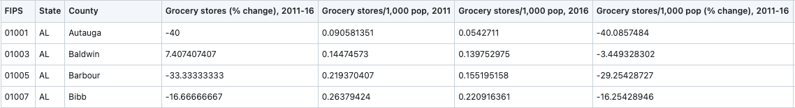
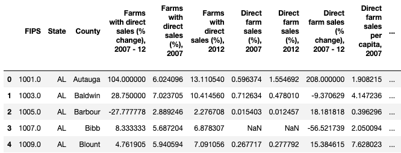
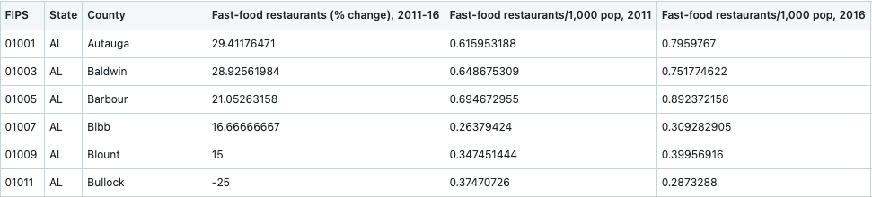
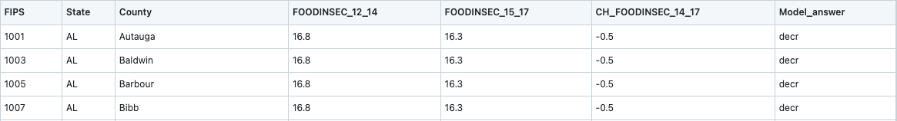
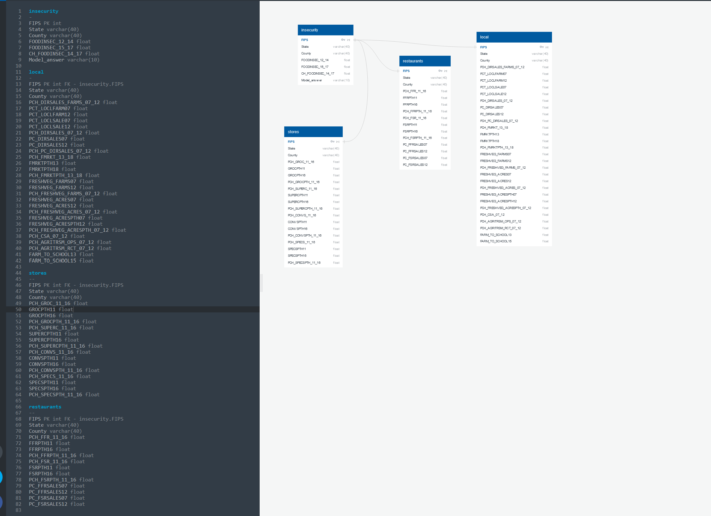

# Final Project: Food Insecurity <dl>by SQL Team 6</dl>

## Overview 
The purpose of this project is to utilize Machine Learning to Predict and Visualize Food Insecurity in the United States of America. It will also take an in depth look at physical access to food in the US and its effects on food insecurity.

### Background
SQL Team Six started the Project initially sharing a concensus to explore datasets  related to Agriculture in general, and Urban Agriculture in New York City. The team members were assigned various roles to seek out potential datasets and sources of data related to the proposed topic. Following the initial meeting, where the various datasets were examined, it was decided that the dataset from the United States Department of Agriculture (USDA) was large enough and had an adequate number of variables which could be manipulated. While team members were contemplating on the ideal dataset to work with, suggestions were welcomed from members pertaining to the Research Question(s)/Hypothesis.

Teammates came up with a number of proposed research questions by the second meeting and the USDA dataset was split among members to clean and filter into tables. It was decided that the Topic of the Project was going to be about Food Insecurity in the USA. Tasks were assigned to each team member and the datasets were expected to be committed to the SQL Team Six repository on individual branches. 

The Highlight of the third meeting was having the datasets from the USDA collated and deciding on which variables were measurable enough to be used in a machine learning model. The Local, Restaurants, Stores and Insecurity Datasets were chosen and the irrelevant datasets were removed from the team github repository by every team member. Teammates then assigned themselves tasks to clean up the README.

The team concluded the Project Week 1 submission deliverables during the fourth meeting by finishing up with the Schema for the database. The README was updated with screenshots of the tables and the Entity Relationship Diagram (ERD) in time for submission. This meeting involved deliberations on the possible model to use for the machine learning portion of the project. A team member took up the task of searching for data to complement the alreading existing data in order to have the dates synchronized accross the datasets. A couple of the team members took responsibility for the cleaning up and transformation of the data and testing the proposed machine learning model. 

Following the submission of the first project deliverable, Team 6 moved on to planning for submission of the next deliverable. Numerous deliberations took place, with teammates deciding to obtain some time-specific dataset in order to run the unsupervised machine learning model proposed. Other members were assigned to work on dashboard visualizations, after the final cleaned data was uploaded. A draft powerpoint presentation was  also started as a guide to the final presentation expected by Group 6, upon completion of the final project.

Below, we shall outline and delve into the various elements of the Food Insecurity Project.

### Dataset
SQL Team Six originally expressed interest in agricultural data and found a comprehensive data set from the United States Department of Agriculture. It contains country wide information on food insecurity and its related areas on a state and county level. 

The original 2020 Food Environment Atlas dataset can be found [here](https://www.ers.usda.gov/data-products/food-environment-atlas/data-access-and-documentation-downloads/).
Direct download [here](https://www.ers.usda.gov/webdocs/DataFiles/80526/FoodEnvironmentAtlas.xls?v=2489.7)
2009-2011 food insecurity data: https://www.ers.usda.gov/webdocs/publications/45020/30967_err141.pdf

Datasets used for the projet/analysis: 
[insecurity.csv](https://github.com/macicchino/Food_Insecurity/blob/main/Datasets/insecurity.csv) 
[stores.csv](https://github.com/macicchino/Food_Insecurity/blob/main/Datasets/stores.csv) 
[local.csv](https://github.com/macicchino/Food_Insecurity/blob/main/Datasets/local.csv) 
[restaurants.csv](https://github.com/macicchino/Food_Insecurity/blob/main/Datasets/restaurants.csv) 

### Description of Data
The Tables below include Stores Table, Local Table, Restaurants Table and Insecurity Table. 

### Tables 

**Stores Table**

**Local Table**

**Restaurants Table**

**Insecurity Table**

### Table Schemas

**Insecurity Schema**

## Objective
From the above data set the team will look at agriculture, general grocery access, and the restaurant industry as it relates to food insecurity. With this data, the group hopes to draw comparisons and craft conclusions about how physical access to food influences food insecurity. A model will also be created that predicts possible changes in food insecurity based on the original data.

### Questions
How does physical access to food through restaurants, grocery stores and agriculture impact food insecurity?

#### Potential topics
- Does restaurant availability contribute to lowering food insecurity?
- Which has a higher positive impact on food access: having more farmers markets or more general grocery stores?
- How does agritourism influence food insecurity?
- How do community supported farms verses regular farms have an impact?
                     
